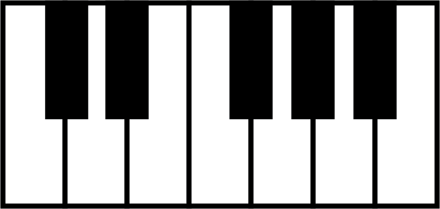
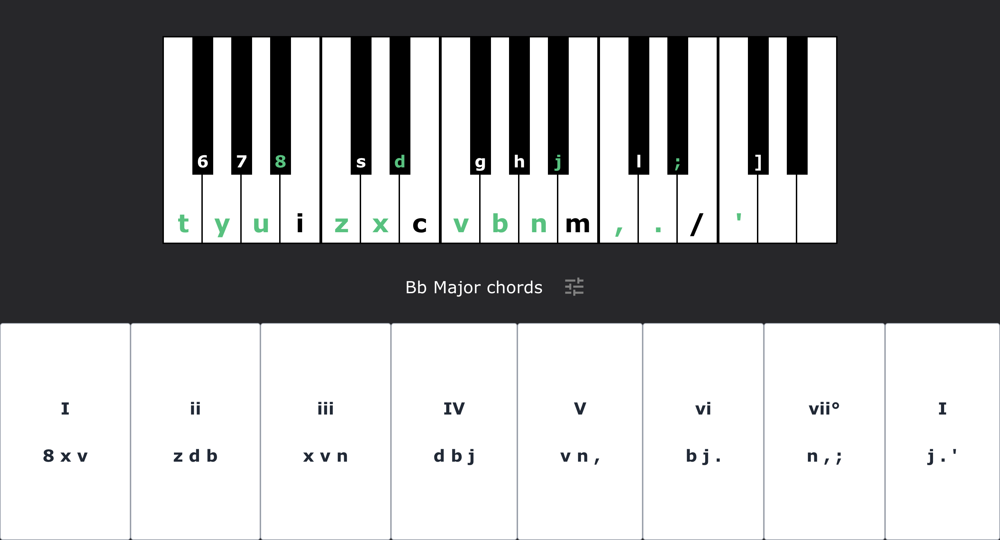
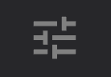
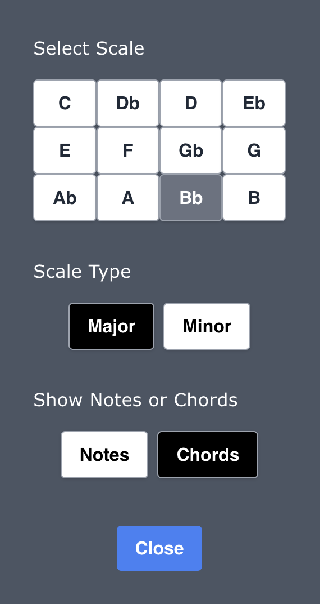
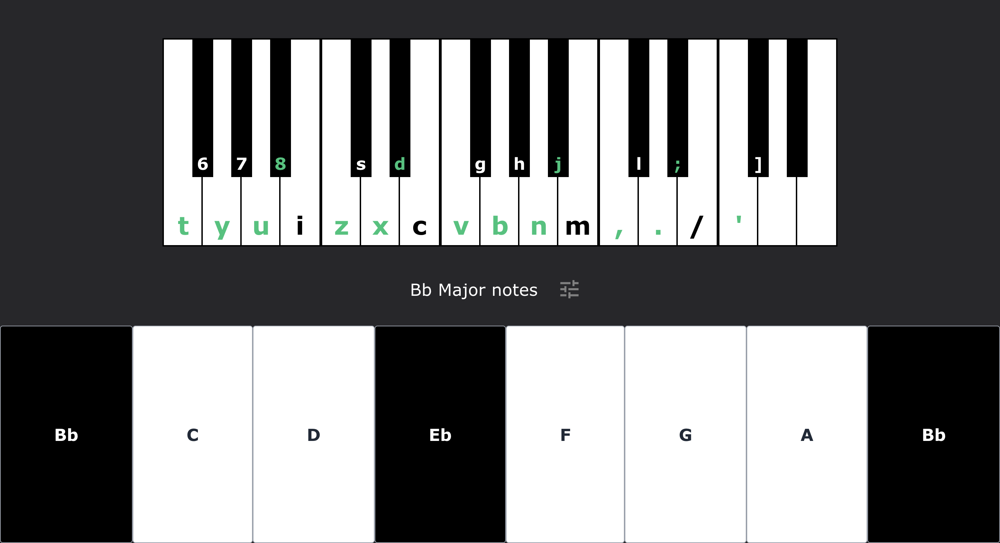
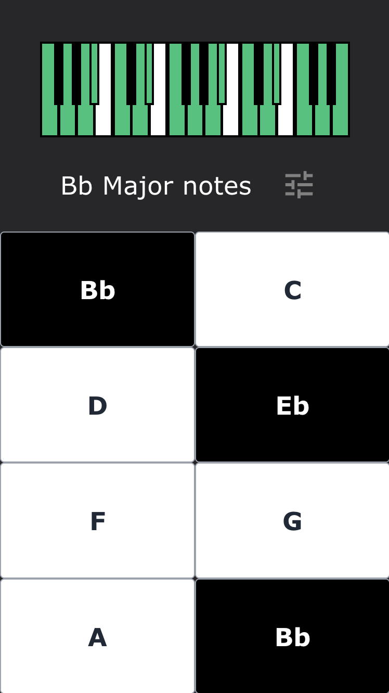
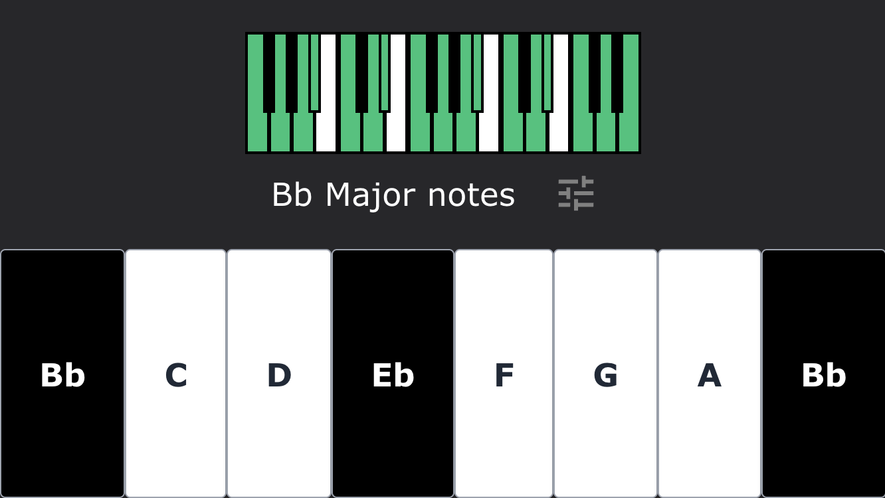

    

<h1 align="center"><strong>Keyboard</strong></h1>

    
    
    

Keyboard is a playable web piano that helps you to learn piano scales and their chords.

Press keys on your keyboard to trigger the corresponding notes on the piano.

    

Playable notes in the selected scale are highlighted green on the piano.

Chord buttons show you the keys to press together to play the scale's chords. Pressing a chord button plays the chord and highlights the chord's notes in blue.

    
    
    

Click the settings icon to set your scale, scale type (major or minor) and whether you see the scale's notes or chords.

You can also use the keyboard shortcut '0' (zero) to pull up the settings menu.

    

Note Buttons are colored so that you can easily see if a note is a black or a white key on the piano.

Note Buttons play the corresponding note when clicked.

## Mobile

Keyboard is also available to use on mobile browsers.

Select a scale to see its notes and chords, and press the buttons to have the notes shown on the keyboard as their audio plays.

    

    

